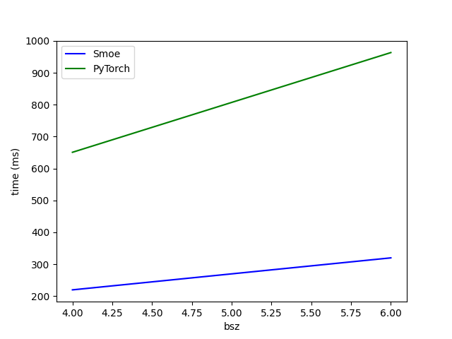

## Versions & Environments

1. Pip: please see [requirements.txt](./requirements.txt)
2. Python: `3.10.2`

## Notes

1. In order to make smoe work with python `3.10.2` (we do only have this version), I removed triton autotune and hardcode the static config ([issue](https://github.com/shawntan/scattermoe/issues/3))
2. I extracted smoe related stuff into one file for testing convenience
3. I removed [allow_tf32](https://github.com/shawntan/scattermoe/blob/0526612bd53f3fb4dc3418eaa2876c89efe5e4e2/scattermoe/kernels/ops.py#L111) because it seems to affect the precision?

## Observation

1. fp16 kernel is slower than huggingface implementation
2. fp32 kernel is much faster than huggingface as claimed in the paper

## Install dependencies

```bash
$ pip install -r requirements.txt
```

## Correctness test

```bash
$ pytest test_moe.py::test_correctness -s
```

## Speed test

```bash
$ pytest test_moe.py::test_bench_speed_moe_wrapper -s
```


## Memory test

```bash
$ pytest test_moe.py::test_bench_memory_moe_wrapper -s
```

## Results


| Image | Description |
|-------|-------------|
|  | FP32 Speed Benchmark for MoE |
|  | FP16 Speed Benchmark for MoE |
|  | Memory Benchmark for MoE |